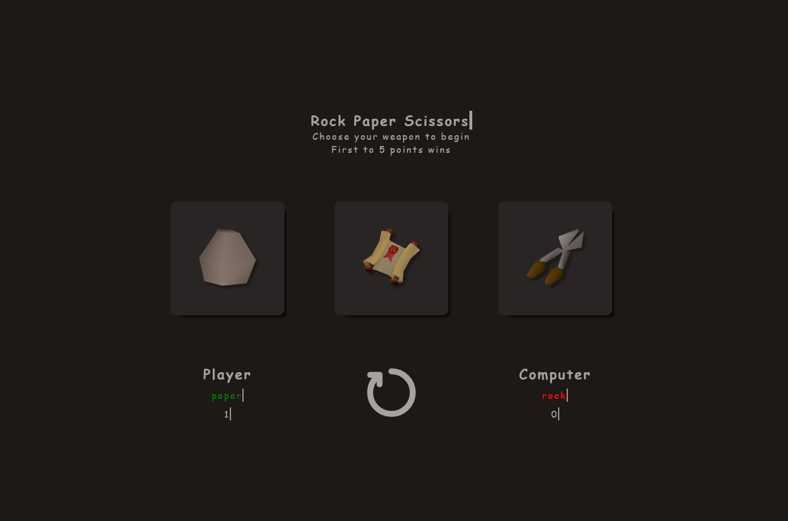

# TOP-rock-paper-scissors
Rock Paper Scissors game for The Odin Project

The original scope of this project was to create a basic console-based rock paper scissors game. This was the first Javascript project as part of The Odin Project's corriculum.

Later on, the corriculum revisited this project to add a user interface, rather than a console-based game.
[Link to live page](https://jonathan-d-n.github.io/rock-paper-scissors/)

## Features
* Animations featuring typewriter effects as well as scale, opacity, and translate changes.
    * Methods of animating page elements used in this project:
        * CSS Pseudo-classes, CSS class/id changes, and Javascript.
* Fully playable within the browser window.
* Reset feature allows for multiple games to be played without reloading the page.

### Things I learned through this project: 
* I have begun to understand the intricacies of animating page elements and keeping things organized while utilizing the different methods of animation mentioned above.
* I learned the basics of SASS.
* The importance of thoroughly testing every new feature impletemented before moving on to the next feature